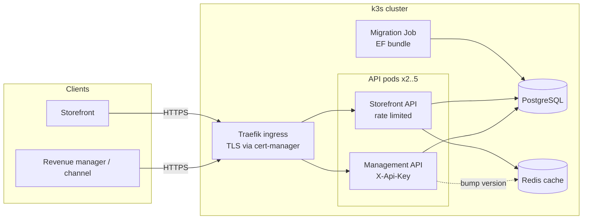
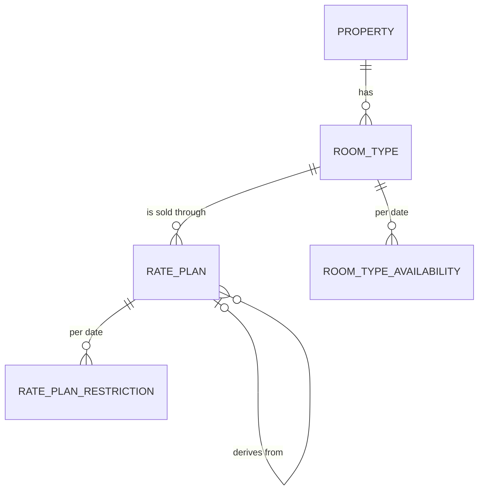
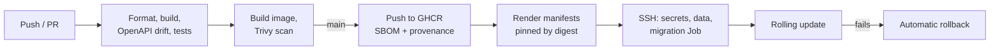

# Booking Engine

A hotel distribution backend: properties define room types and rate plans, revenue managers push availability, rates and restrictions (ARI) in bulk, and a public storefront API prices stays in real time. There is no checkout; the system covers setup, pricing and availability search.

The domain follows the model used by channel managers and OTAs (room-type-level inventory, rate-plan-level pricing and restrictions, closed to arrival/departure, minimum/maximum stay, per-person pricing, derived rates), so the data could be exchanged with distribution partners without translation.

**Stack:** .NET 10 (Minimal APIs, EF Core 10), PostgreSQL 18, Redis 8, Docker, k3s (Kubernetes), GitHub Actions.

## Highlights

- **Pricing engine as a pure domain function.** Every restriction is evaluated on the date the industry defines for it (arrival, each night, or departure), covered by focused unit tests.
- **Bulk ARI writes without an ORM bottleneck.** Date ranges with weekday filters expand to per-date rows written with `unnest` + `MERGE`, serialized per property with a Postgres advisory lock. A test proves concurrent writers collide without it.
- **Cache invalidation without key scans.** Redis entries live under a per-property version number and every write bumps it, so cached prices are replaced as soon as data changes (edge cases in [ADR 0004](docs/adr/0004-versioned-cache-invalidation.md)). If Redis goes down, the API keeps answering from the database and reports `Degraded`.
- **Contract-first documentation.** OpenAPI 3.1 is generated at build time and committed; CI fails when the code and the published contract drift apart. Scalar serves interactive docs at `/docs`.
- **Production path verified end to end.** Chiseled non-root image, migrations as a Kubernetes Job, zero-downtime rolling updates with automatic rollback, network policies, and a CI/CD pipeline that tests, scans, attaches SBOM and provenance attestations and deploys by image digest.

## Architecture



The solution follows Clean Architecture with the dependency rule enforced by project references:

| Project | Responsibility |
|---|---|
| `BookingEngine.Domain` | Entities with invariants, restriction semantics, `StayPricer`. No framework dependencies. |
| `BookingEngine.Application` | Use cases per feature (`Properties`, `RoomTypes`, `RatePlans`, `Ari`, `Storefront`), `Result<T>`, abstractions. |
| `BookingEngine.Infrastructure` | EF Core mappings and migrations, bulk ARI writer, Redis cache, health checks. |
| `BookingEngine.Api` | Minimal API endpoints, API key authentication, ProblemDetails mapping, OpenAPI, rate limiting. |

## Domain model



- **Availability** belongs to the room type (physical inventory); **rates and restrictions** belong to the rate plan.
- **Sell modes:** `per_room`, or `per_person` with an adjustment per adult count relative to the daily base rate. Children add a flat fee per night.
- **Derived rate plans** take the parent's price for the requested occupancy and apply a percent or fixed adjustment (one level deep).
- **A date without stored data is not sellable.** Missing data never turns into an accidental open sale.

| Restriction | Checked against |
|---|---|
| `stop_sell` | every night of the stay |
| `closed_to_arrival` | the arrival date |
| `closed_to_departure` | the departure date (not a night of the stay) |
| `min_stay_arrival` | the value on the arrival date |
| `min_stay_through` | the highest value across the nights of the stay |
| `max_stay` | the value on the arrival date |

## API overview

Management endpoints live under `/api/v1/properties` and require the `X-Api-Key` header. Storefront endpoints live under `/api/v1/storefront` and are public but rate limited per client IP.

| Area | Endpoints |
|---|---|
| Properties | `POST/GET /properties`, `GET/PUT/DELETE /properties/{id}` |
| Room types | `POST/GET /properties/{id}/room-types`, `GET/PUT/DELETE .../{roomTypeId}` |
| Rate plans | `POST/GET /properties/{id}/rate-plans`, `GET/PUT/DELETE .../{ratePlanId}` |
| ARI | `POST/GET /properties/{id}/availability`, `POST/GET /properties/{id}/restrictions` |
| Storefront | `GET /storefront/properties/{id}`, `.../search`, `.../calendar` |

Errors follow RFC 9457 (`application/problem+json`) with a stable machine-readable `code`: `400` for malformed requests, `404` for missing resources, `409` for conflicts and `422` for business rule violations.

```bash
# Close Saturdays to arrival and require two nights for the next month
curl -X POST http://localhost:8080/api/v1/properties/$PROPERTY_ID/restrictions \
  -H "X-Api-Key: dev-management-key" -H "Content-Type: application/json" \
  -d '{"values":[{"rate_plan_id":"'$RATE_PLAN_ID'","date_from":"2026-11-01","date_to":"2026-11-30",
       "days":["sa"],"closed_to_arrival":true,"min_stay_arrival":2}]}'

# Price a stay
curl "http://localhost:8080/api/v1/storefront/properties/$PROPERTY_ID/search?checkin=2026-11-06&checkout=2026-11-08&adults=2"
```

The full contract is in [`docs/openapi/booking-engine.json`](docs/openapi/booking-engine.json) and browsable at `/docs` on a running instance.

## Running locally

Prerequisites: .NET SDK 10 and Docker.

```bash
# Full stack in containers: Postgres, Redis, migrations, API on http://localhost:8080
docker compose --profile app up --build
```

For development with hot reload, run only the data services and start the API from the SDK:

```bash
docker compose up -d
dotnet tool restore
dotnet ef database update --project src/BookingEngine.Infrastructure --startup-project src/BookingEngine.Api
dotnet run --project src/BookingEngine.Api
```

The API listens on http://localhost:5245 with interactive docs at `/docs`. The development API key is `dev-management-key` (see `appsettings.Development.json`).

## Testing

```bash
dotnet test
```

- **Unit tests** cover domain invariants, the pricing engine and ARI range expansion.
- **Integration tests** run the real API (`WebApplicationFactory`) against PostgreSQL and Redis started by Testcontainers. They cover HTTP contracts, database constraints, cache invalidation, rate limiting, concurrent bulk writes and behaviour with Redis unavailable.
- A schema test fails if the EF model and the committed migrations disagree.

## Delivery



Deployment targets a single-node k3s cluster; the manifests are plain Kustomize and run unchanged on managed Kubernetes. Server setup and operations are described in the [deployment runbook](docs/deployment.md).

## Design decisions

Each significant decision is recorded with its context and the alternatives considered:

1. [Clean Architecture with feature folders](docs/adr/0001-clean-architecture-with-feature-folders.md)
2. [ARI data model and restriction semantics](docs/adr/0002-ari-data-model.md)
3. [Bulk ARI writes with MERGE and advisory locks](docs/adr/0003-bulk-ari-writes.md)
4. [Versioned cache invalidation](docs/adr/0004-versioned-cache-invalidation.md)
5. [API conventions and error contract](docs/adr/0005-api-conventions.md)
6. [Deployment on k3s](docs/adr/0006-deployment-on-k3s.md)

## Scope

Out of scope by design: bookings and checkout, multi-tenant accounts with per-tenant API keys, taxes and fees, child age bands, and restriction inheritance for derived plans.
